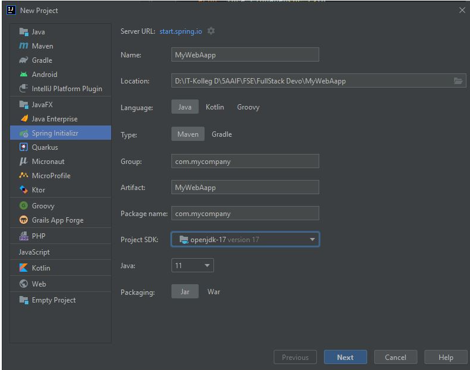
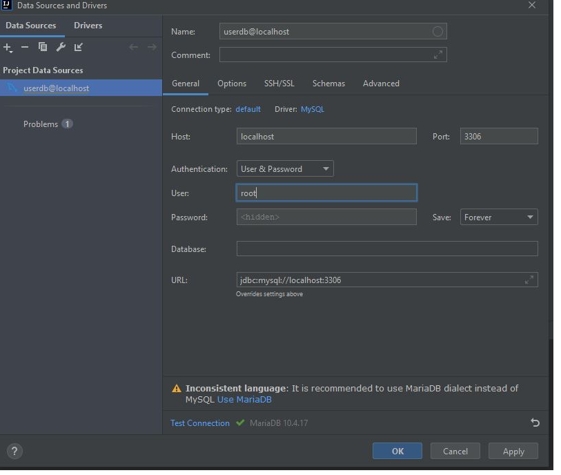
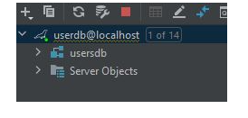
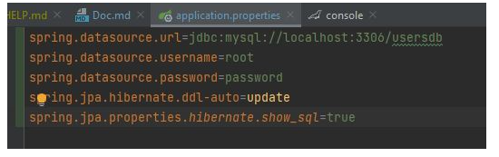
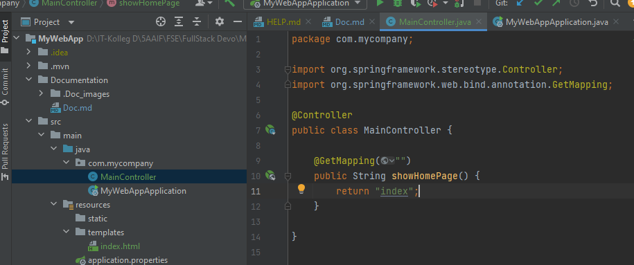
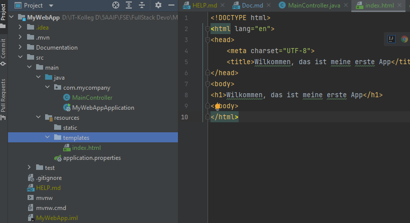
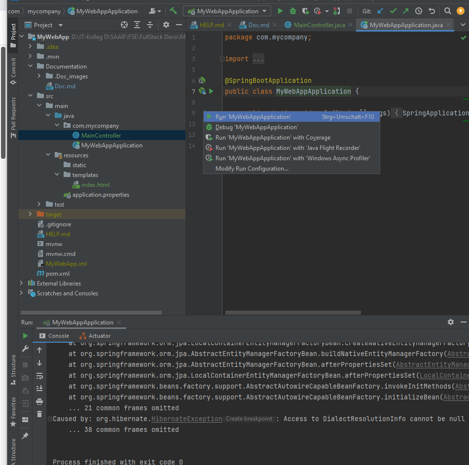
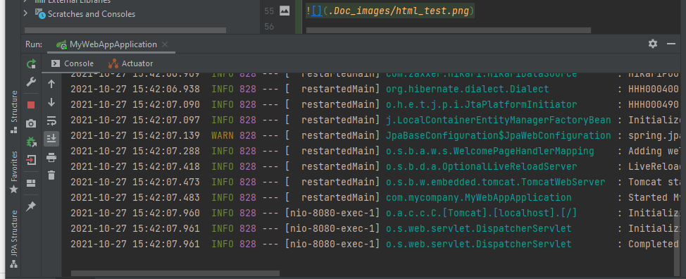

#AUFGABE 2: SPRING BOOT FULLSTACK USER-MANAGEMENT 

##Table of Contents

###Neues Projekt erstellen:
 

### Create Database Sceme:

MySQL anbinden:

Neues Sceme erstellen:

### Configure DataSource Properties:

Properties für die SQL Schnitstelle:

### Code Home Page 

Code MainController class

Code index.html

Run the application

Erster Versuch gab eine Fehlermeldung zurück.
 
Grund : Bei den properties wurde ein Passwort vergeben das nicht vorhanden ist.
 
Lösung: password line gelöscht.

Zweiter Versuch:

