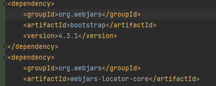
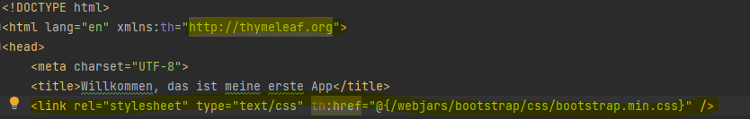
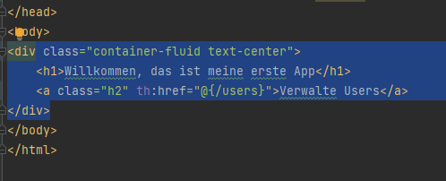
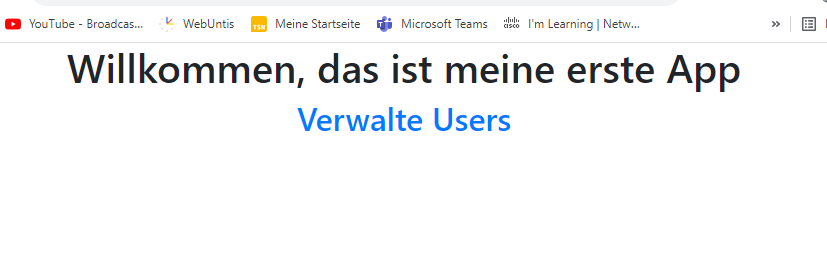
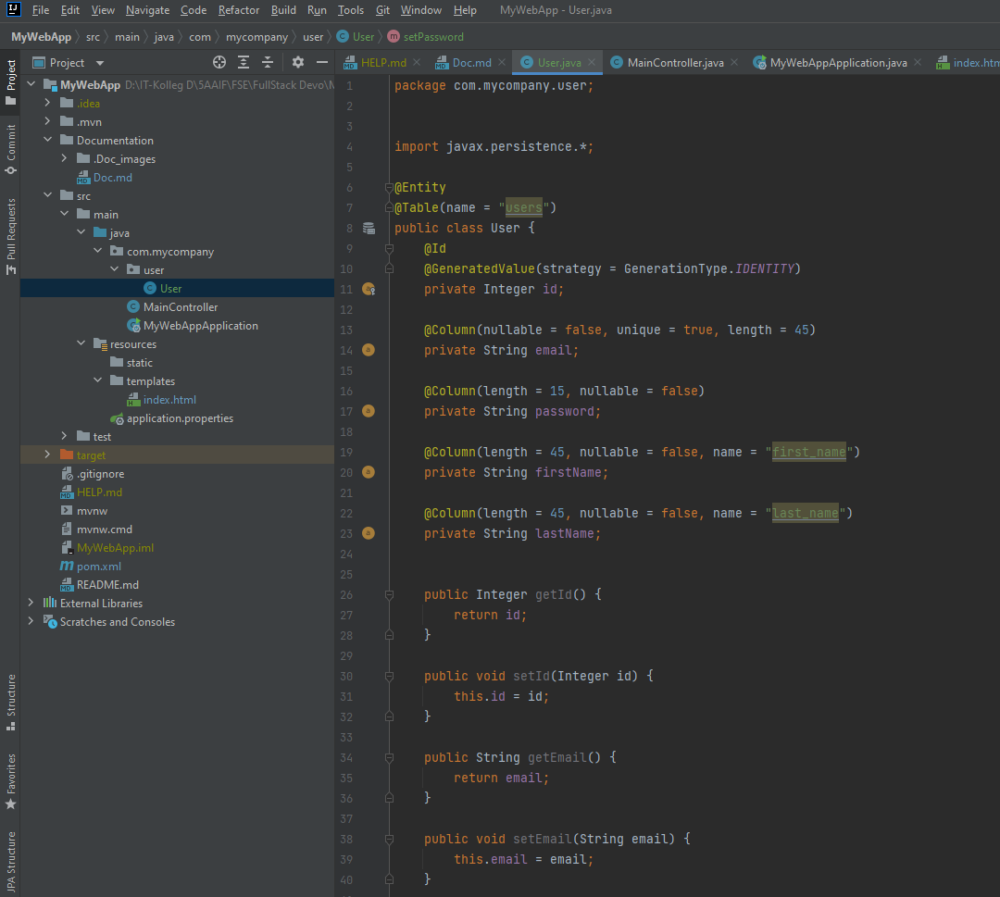
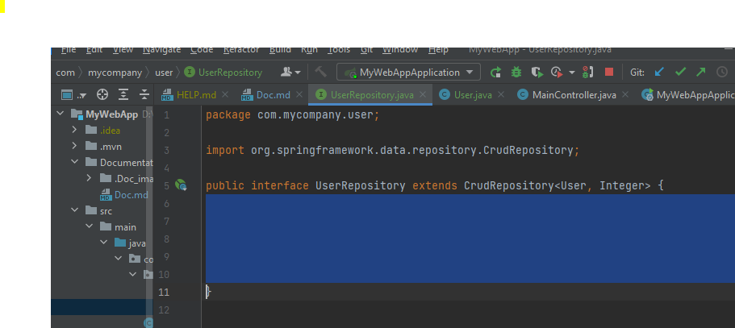
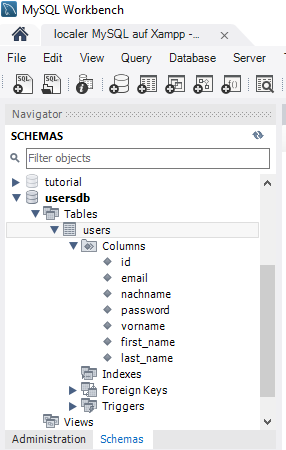
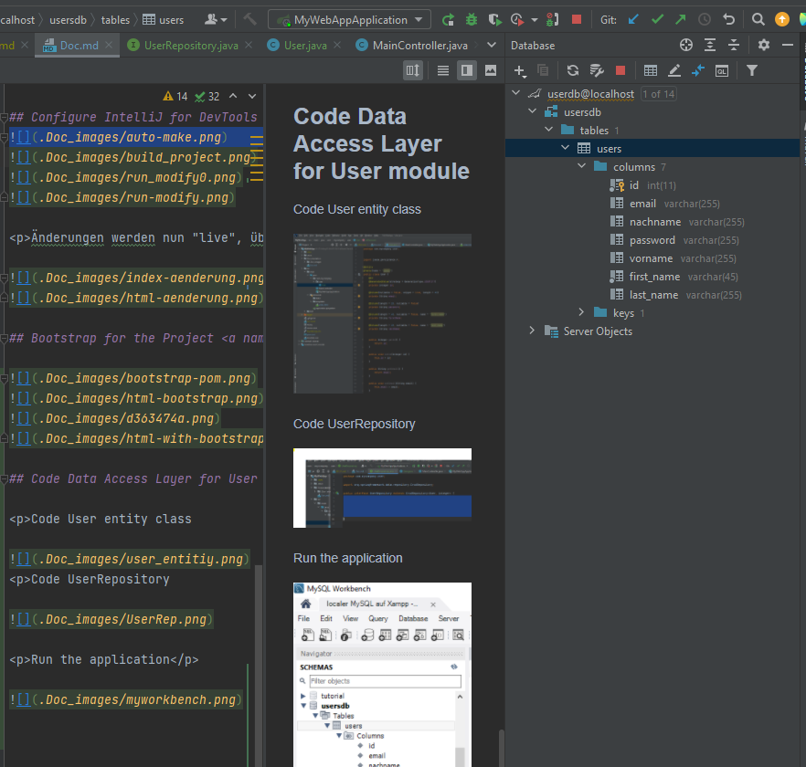

# AUFGABE 2: SPRING BOOT FULLSTACK USER-MANAGEMENT 

## Table of Contents
1. [Neues Projekt erstellen](#neues_projekt)
2. [Create Database Sceme](#create_database)
3. [Configure DataSource Properties](#configure_data_source)
4. [Code Home Page](#code_home_page)
5. [Configure IntelliJ for DevTools](#configure)
6. [Bootstrap for the Project](#bootstrap)
7. [Code Data Access Layer for User module](#code_data_access_layer)
8. [Code Unit Tests](#code_unit_tests)

### Neues Projekt erstellen: 
 

### Create Database Sceme: 

MySQL anbinden:

Neues Sceme erstellen:

### Configure DataSource Properties: 

Properties für die SQL Schnitstelle:

### Code Home Page 

Code MainController class

Code index.html

Run the application

Erster Versuch gab eine Fehlermeldung zurück.
 
Grund : Bei den properties wurde ein Passwort vergeben das nicht vorhanden ist.
 
Lösung: password line gelöscht.

Zweiter Versuch:

## Configure IntelliJ for DevTools 

Änderungen werden nun "live", übernommen.

## Bootstrap for the Project 

## Code Data Access Layer for User module 

Code User entity class

Code UserRepository

Run the application

## Code Unit Tests 

Use Spring Data JPA Test

Test CRUD operation on users

